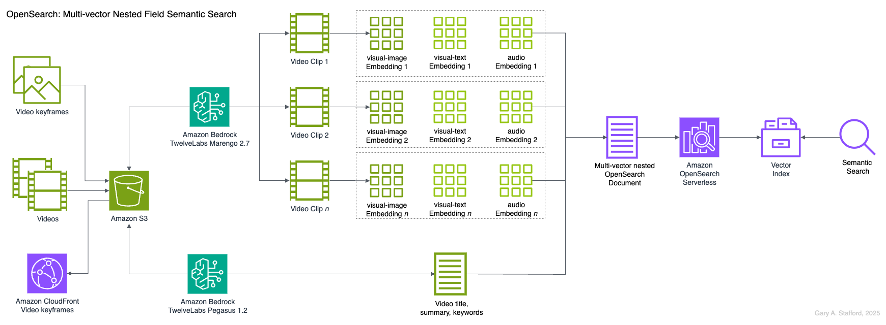

# Multi-Vector Semantic Search: Advanced Video Search with TwelveLabs and Amazon OpenSearch

Code for the video, [Multi-Vector Semantic Search with TwelveLabs on Bedrock and Amazon OpenSearch](https://youtu.be/aXyPRyCiqfE). How TwelveLabs AI Models and Amazon OpenSearch Serverless enable multi-vector semantic and hybrid search for video content.



## Usage Instructions

## Prerequisites

- Python 3.12+
- AWS credentials
- Amazon S3 bucket
- Amazon OpenSearch Serverless collection (optional)
- [FFmpeg](https://ffmpeg.org/) (optional for keyframe generation)

## Installation

Clone the repository:

```bash
git clone https://github.com/garystafford/twelve-labs-opensearch-demo.git
cd twelve-labs-opensearch-demo
```

Rename `python-dotenv` file:

Mac:

```bash
mv env.txt .env
```

Windows:

```bat
rename env.txt .env
```

Enter the following environment variables in the `.env` file:

```ini
AWS_REGION=<Your AWS Region>
AWS_ACCESS_KEY_ID=<Your AWS Access Key ID>
AWS_SECRET_ACCESS_KEY=<Your AWS Secret Access Key>
AWS_SESSION_TOKEN=<Your AWS Session Token>

S3_VIDEO_STORAGE_BUCKET_MARENGO=<Your S3 Bucket Name>
S3_VIDEO_STORAGE_BUCKET_PEGASUS=<Your S3 Bucket Name>

OPENSEARCH_ENDPOINT=<Your OpenSearch Endpoint>
```

Create a Python virtual environment for the Jupyter Notebook:

Mac:

```bash
python -m pip install virtualenv -Uq
python -m venv .venv
source .venv/bin/activate

python -m pip install -r requirements.txt -Uq
```

Windows:

```bat
python -m venv .venv
.venv\Scripts\activate

python -m pip install pip -Uq
python -m pip install -r requirements.txt -Uq
```

Check for FFmpeg:

```bash
ffmpeg -version
```

### Run the Code

Run the following Python scripts.

```bash
python ./ffmpeg_extract_keyframe.py
python ./generate_embeddings_marengo.py
python ./generate_analyses_pegasus.py
python ./prepare_opensearch_documents.py
```

Access the Jupyter Notebook for all OpenSearch-related code:

[twelve-labs-bedrock-demo.ipynb](twelve-labs-bedrock-demo.ipynb)

## Alternative: Running OpenSearch in Docker

As an alternative to AWS, you can run OpenSearch locally using Docker. This is intended for development environments only and is not secure.

Mac:

```bash
docker swarm init

SWARM_ID=$(docker node ls --format "{{.ID}}")
docker stack deploy -c docker-compose.yml $SWARM_ID

docker service ls
```

Windows:

```bat
docker swarm init

for /f "delims=" %x in ('docker node ls --format "{{.ID}}"') do set SWARM_ID=%x
docker stack deploy -c docker-compose.yml %SWARM_ID%

docker service ls
```

## Basic OpenSearch Command

You can interact with your OpenSearch index in the Dev Tools tab of the OpenSearch Dashboards UI.

```text
GET tv-commercials-index/_settings

GET tv-commercials-index/_count

GET tv-commercials-index/_search
{
  "query": {
    "match_all": {}
  }
}
```

---

_The contents of this repository represent my viewpoints and not those of my past or current employers, including Amazon Web Services (AWS). All third-party libraries, modules, plugins, and SDKs are the property of their respective owners._
